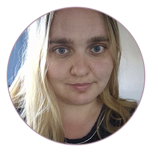

# LEONORA KOLESSOVA

### JUNIOR FRONTEND DEVELOPER

### AGE 29 YERS

---



---

# CONTACT INFORMASHION

---

**Phone:** +7(777) 577 91 77

**E-mail:** assassya200895@gmail.com

**Telegram:** @LeonoraR

###### [Leonora-LeoNoir](https://github.com/Leonora-LeoNoir "GitHub link")

---

# ABOUT ME

---

I studied to be a [programmer](#3), and I've been working in IT all my life. I am a fast learner and am eager to learn new things.

There are skills in [video editing](#1) and [photo processing](#2).

In my free time from studies and work I am engaged in writing.

---

# SKILLS

---

- Programming

  - HTML
  - CSS
  - Python
  - Borland Delphi
  - MS Visual C++

- Working with Graphics<a id="2"></a>

  - Adobe Photoshop
  - Adobe Illustrator
  - Figma
  - Affinity Disigner

- Video editing<a id="1"></a>
  - Davinche Resolv
  - CapCut
  - Adobe After Effects

---

# CODE EXAMPLE

---

**Test code from Codewars**

```
function multiply(a, b){
 return a * b
}
```

# WORK

---

Content specialist at DN.ru

---

# EDUCACION

---

- Secondary professional: Programmer Technician - Almaty Technical-Economic College<a id="3"></a>
- Unfinished higher education (3rd semester) Fullstack Developer - Synergy University
- Courses
  - HTML&CSS
  - Web Design

---

# LANGUAGES

---

- Russian - Native
- English - A1/A2

---
